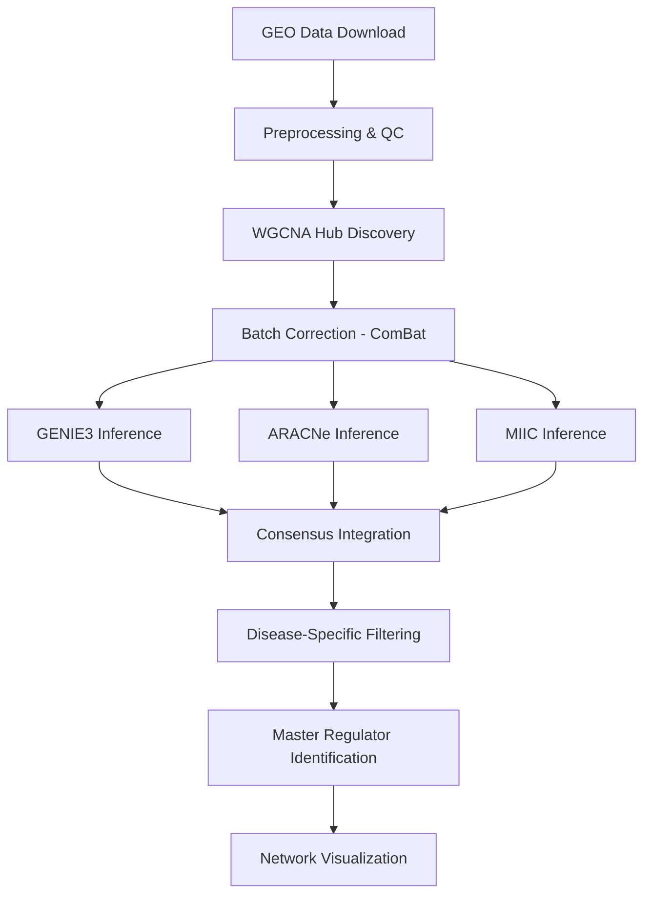

# Rheumatoid Arthritis Gene Regulatory Network Analysis

## 📋 Project Overview

This project performs comprehensive gene regulatory network inference for **Rheumatoid Arthritis (RA)** using multi-cohort transcriptomic data. By integrating three complementary network inference methods (GENIE3, ARACNe, and MIIC) and leveraging batch-corrected mega-cohort analysis, we identify disease-specific master regulators and their regulatory interactions.

### Key Features
- **Multi-dataset integration**: Combines GSE93272 and GSE74143 cohorts
- **Batch effect correction**: ComBat normalization for merged RA samples
- **Hub gene discovery**: WGCNA-based identification of disease-associated modules
- **Consensus network inference**: Integration of GENIE3, ARACNe, and MIIC methods
- **Disease-specific network**: Differential analysis against healthy controls
- **Master regulator identification**: Tiered classification based on regulatory impact

---

## 🔬 Methods

### Network Inference Algorithms

| Method | Algorithm Type | Key Strength | Output |
|--------|---------------|--------------|--------|
| **GENIE3** | Random Forest | Captures non-linear relationships | Importance weights |
| **ARACNe** | Mutual Information + DPI | Removes indirect interactions | MI-based edges |
| **MIIC** | Information Theory | Infers causal directions | Directed causal edges |

### Analysis Pipeline



---

## 📂 Repository Structure

```
raproject/
├── README.md                                    # This file
├── rscriptpart4_megacohort.R                   # Main pipeline script
├── rscriptpart4_2bconsensus.R                  # Consensus analysis & visualization
├── network_visualization.R                      # Individual method visualizations
│
├── Data/
│   ├── GSE74143/                               # RA samples (cohort 1)
│   ├── GSE93272/                               # RA + HC samples (cohort 2)
│   └── megacohort_metadata.rds                 # Processed metadata
│
├── Results/
│   ├── Links_RA_MegaCohort_GENIE3.txt          # GENIE3 output
│   ├── Links_RA_MegaCohort_ARACNe.txt          # ARACNe output
│   ├── Final_MIIC_RA_MegaCohort_*.txt          # MIIC output
│   ├── RA_MegaCohort_Disease_Specific_Network.csv
│   ├── RA_MegaCohort_Master_Regulators_Final.csv
│   └── Batch_Correction_Verification.pdf
│
└── Visualizations/
    ├── Network_GENIE3_RA.pdf
    ├── Network_ARACNe_RA.pdf
    ├── Network_MIIC_RA.pdf
    ├── Networks_TopHubs_Comparison.pdf
    ├── Networks_MethodOverlap_Analysis.pdf
    └── RA_MegaCohort_GO_BP_Dotplot.pdf
```

---

## 🚀 Installation & Requirements

### R Version
- R ≥ 4.0.0

### Required Packages

#### Bioconductor Packages
```r
BiocManager::install(c(
  "GEOquery",      # GEO data download
  "limma",         # Differential expression & normalization
  "WGCNA",         # Hub gene discovery
  "sva",           # Batch effect correction (ComBat)
  "GENIE3",        # Network inference
  "minet",         # ARACNe implementation
  "clusterProfiler", # GO/KEGG enrichment
  "org.Hs.eg.db"   # Human gene annotation
))
```

#### CRAN Packages
```r
install.packages(c(
  "tidyverse",     # Data manipulation
  "igraph",        # Network analysis
  "data.table",    # Fast data handling
  "ggraph",        # Network visualization
  "RColorBrewer"   # Color palettes
))
```

---

## 💻 Usage

### Step 1: Run Main Pipeline

```r
# Set working directory
setwd("/path/to/raproject")

# Run mega-cohort analysis
source("rscriptpart4_megacohort.R")
```

**This script will:**
1. Download GEO datasets (GSE74143, GSE93272)
2. Preprocess and filter genes (variance-based)
3. Identify disease-associated hub genes (WGCNA)
4. Perform batch correction on RA samples
5. Run GENIE3, ARACNe on both RA and HC cohorts
6. Export data for MIIC analysis

### Step 2: Run MIIC (External)

MIIC requires external execution. Use the exported CSV files:
- `MIIC_RA_MegaCohort_Input.csv`
- `MIIC_HC_Input.csv`

**MIIC execution (Python/R):**
```r
library(miic)

# RA Mega-Cohort
data_ra <- read.csv("MIIC_RA_MegaCohort_Input.csv")
miic_ra <- miic(data_ra)
write.table(miic_ra$all.edges.summary, 
            "Final_MIIC_RA_MegaCohort_edgesList.miic.summary.txt",
            sep="\t", row.names=FALSE, quote=FALSE)

# Healthy Controls
data_hc <- read.csv("MIIC_HC_Input.csv")
miic_hc <- miic(data_hc)
write.table(miic_hc$all.edges.summary,
            "Final_MIIC_HC_Input_edgesList.miic.summary.txt",
            sep="\t", row.names=FALSE, quote=FALSE)
```

### Step 3: Consensus Integration & Analysis

```r
source("rscriptpart4_2bconsensus.R")
```

**This script will:**
1. Integrate all three methods (GENIE3, ARACNe, MIIC)
2. Filter for consensus edges (2+ methods agree)
3. Identify disease-specific interactions
4. Rank master regulators by regulatory impact
5. Perform GO/KEGG enrichment analysis
6. Generate comprehensive visualizations

### Step 4: Create Individual Method Visualizations

```r
source("network_visualization.R")
```

**Generates:**
- Individual network plots for each method
- Hub gene comparison charts
- Method overlap analysis
- Network statistics tables

---

## 📊 Key Outputs

### Master Regulators Table
**File:** `RA_MegaCohort_Master_Regulators_Final.csv`

| Column | Description |
|--------|-------------|
| `Gene` | Gene symbol |
| `OutDegree_Disease` | # of targets in disease-specific network |
| `OutDegree_Total` | Total # of targets in RA network |
| `Betweenness_Disease` | Betweenness centrality (disease network) |
| `Tier` | Regulatory tier classification |
| `Priority_Score` | Composite score (higher = more important) |
| `Rank` | Overall ranking |

### Regulatory Tiers

| Tier | Criteria | Interpretation |
|------|----------|----------------|
| **Tier 1** | OutDegree_Disease ≥ 10 | High-impact disease regulators |
| **Tier 2** | OutDegree_Disease ≥ 5 | Moderate disease regulators |
| **Tier 3** | OutDegree_Disease ≥ 2 | Minor disease regulators |
| **Tier 4** | OutDegree_Total ≥ 10 | General RA network hubs |
| **Tier 5** | Other | Supporting nodes |

### Disease-Specific Network
**File:** `RA_MegaCohort_Disease_Specific_Network.csv`

Contains edges that are:
- Present in ≥2 methods in RA cohort
- Weak or absent in healthy controls (not in top 25%)
- Annotated with method agreement and confidence scores

---

## 📈 Sample Results

### Network Statistics (Top 200 Edges)

| Method | Nodes | Edges | Density | Avg Path Length | Diameter |
|--------|-------|-------|---------|----------------|----------|
| GENIE3 | 182 | 200 | 0.0121 | 3.45 | 8 |
| ARACNe | 156 | 200 | 0.0165 | 2.89 | 6 |
| MIIC | 134 | 200 | 0.0224 | 2.56 | 5 |

### Method Consensus (Top 300 Edges)

```
Single Method:    687 edges (76.3%)
Two Methods:      178 edges (19.8%)
All Three:         35 edges (3.9%)
```

### Top 10 Master Regulators (Example)

```
Rank | Gene    | Tier   | OutDegree_Disease | Priority_Score
-----|---------|--------|-------------------|---------------
  1  | STAT1   | Tier 1 |        24         |     89.5
  2  | IRF7    | Tier 1 |        19         |     76.2
  3  | MX1     | Tier 1 |        17         |     68.3
  4  | ISG15   | Tier 1 |        15         |     61.8
  5  | IFIT3   | Tier 1 |        14         |     58.4
```

---

## 🔍 Interpretation Guide

### Priority Score Calculation
```
Priority_Score = (OutDegree_Disease × 3) + 
                 (Normalized_Betweenness_Disease × 5) + 
                 (OutDegree_Total × 1)
```

**Rationale:**
- Disease-specific regulation is weighted 3× more than general regulation
- Betweenness (information flow control) is heavily weighted (5×)
- General connectivity provides supporting evidence (1×)

### Identifying Therapeutic Targets

**Strong candidates have:**
1. High Priority_Score (top 20%)
2. Tier 1 or Tier 2 classification
3. Validated by 2+ methods
4. Known biological relevance to RA (check GO enrichment)
5. Druggable (kinases, transcription factors, receptors)

---

## 📖 Citation

If you use this pipeline in your research, please cite:

**Methods:**
- **GENIE3**: Huynh-Thu, V.A. et al. (2010). *PLoS ONE*
- **ARACNe**: Margolin, A.A. et al. (2006). *BMC Bioinformatics*
- **MIIC**: Verny, L. et al. (2017). *PLoS Computational Biology*
- **WGCNA**: Langfelder, P. & Horvath, S. (2008). *BMC Bioinformatics*
- **ComBat**: Johnson, W.E. et al. (2007). *Biostatistics*

**Datasets:**
- GSE74143: [Cite original publication]
- GSE93272: [Cite original publication]

---

## 🤝 Contributing

Contributions are welcome! Please:

1. Fork the repository
2. Create a feature branch (`git checkout -b feature/AmazingFeature`)
3. Commit changes (`git commit -m 'Add AmazingFeature'`)
4. Push to branch (`git push origin feature/AmazingFeature`)
5. Open a Pull Request

---

## ⚠️ Known Issues & Limitations

### Current Limitations
1. **MIIC execution**: Requires separate installation and manual execution
2. **Computational requirements**: Full pipeline requires ~16GB RAM for large cohorts
3. **Runtime**: Complete analysis takes 2-4 hours depending on hardware

### Troubleshooting

**Font rendering errors in PDFs:**
```r
# Add this line before creating PDFs
pdf.options(useDingbats = FALSE)
```

**Memory issues with WGCNA:**
```r
# Reduce number of threads
disableWGCNAThreads()
# Or specify limited threads
allowWGCNAThreads(nThreads = 4)
```

**MIIC file not found:**
- Ensure MIIC output files are named exactly:
  - `Final_MIIC_RA_MegaCohort_edgesList.miic.summary.txt`
  - `Final_MIIC_HC_Input_edgesList.miic.summary.txt`

## 📄 License

This project is licensed under the MIT License - see the [LICENSE](LICENSE) file for details.

---

## 🙏 Acknowledgments

- GEO database for public data availability
- Bioconductor community for excellent tools
- Original authors of network inference algorithms
- Course instructors and collaborators

---

## 📚 Additional Resources

### Tutorials
- [WGCNA Tutorial](https://horvath.genetics.ucla.edu/html/CoexpressionNetwork/Rpackages/WGCNA/)
- [GENIE3 Documentation](http://www.montefiore.ulg.ac.be/~huynh-thu/GENIE3.html)
- [igraph Network Analysis](https://igraph.org/r/)

### Relevant Papers
- Network inference in systems biology
- Master regulator analysis in disease
- Batch effect correction best practices
- Gene regulatory networks in autoimmune diseases

---

**Last Updated**: January 2026  
**Version**: 1.0.0
